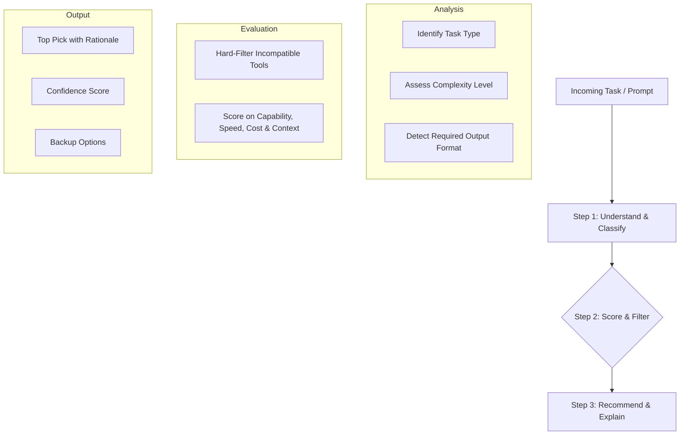

# Executive Project Report: Smart AI Model Router & Recommendation Engine

> **Document Type:** Management & Stakeholder Summary  
> **Status:** Core engine stable and validated for covered domains; pilot-ready with known scope limits  
> **Repository:** `https://github.com/Pratik30122005/Prompt_.git`  

---

## 1. What This Project Is

The **Smart AI Model Router** is an automated decision engine designed to eliminate the guesswork of selecting AI tools for work tasks. When an employee or automated workflow submits an instruction or prompt, the system instantly analyzes what needs to be done and automatically directs the work to the single best AI model for the job—complete with a clear, plain-English explanation of why that model was chosen and 2–3 reliable alternatives.

Instead of relying on individuals to guess whether they should use ChatGPT, Claude, Gemini, Perplexity, or specialized coding tools, the engine makes consistent, high-accuracy recommendations in milliseconds.

---

## 2. Why It Matters (The Business Case)

As organizations adopt multiple specialized AI tools, three operational bottlenecks emerge:

```
                    ┌───────────────────────────────┐
                    │    Core Business Problems     │
                    └───────────────┬───────────────┘
            ┌───────────────────────┼───────────────────────┐
            ▼                       ▼                       ▼
    [ Budget Inefficiency ]  [ Quality Inconsistency ] [ Workflow Mismatch ]
    Paying premium rates      Teams picking tools       Using general text models
    for simple tasks that     ill-suited for specialized for coding/presentation
    fast models handle well   tasks (e.g. data math)    deliverables
```

* **Cost Optimization:** Prevents "overkill" spending. High-cost, slow reasoning models are reserved strictly for difficult multi-step tasks, while fast, low-cost models handle high-volume routine requests.
* **Consistent Quality & Accuracy:** Ensures tasks requiring specialized features (such as live web citations, spreadsheet reconciliation, or visual slide creation) are routed to the specific AI best equipped to handle them.
* **Eliminating Tool Fatigue:** Team members no longer need to keep track of changing model benchmarks, context limits, or release updates. The router maintains that intelligence centrally.

---

## 3. How It Works

The routing pipeline operates through a simple, deterministic 3-step decision flow:



1. **Step 1 — Understand the Task:** The engine inspects the prompt to identify what kind of deliverable is expected (e.g., code, slide presentation, deep research, mathematical reasoning, summary), how deeply it needs to "think", and whether external reference material is mentioned.
2. **Step 2 — Evaluate Candidate Models:** It eliminates models that cannot physically produce the needed format (for example, excluding coding-only tools when a user requests a creative bedtime story). It then scores the remaining models across core dimensions: functional capability, required tool environment, context capacity, and cost sensitivity.
3. **Step 3 — Recommend & Explain:** The engine selects the highest-scoring model, displays a confidence rating, provides an intuitive explanation for the decision, and surfaces 2 backup alternatives.

---

## 4. What Has Been Built

| Component | What It Does in Plain English | Operational Benefit |
| :--- | :--- | :--- |
| **Classification Engine** | Reads incoming prompts and extracts key intent, complexity, and file requirements using clear, deterministic business rules. | Ensures reliable categorization with no LLM call required for routing. |
| **Model Knowledge Base** | A structured catalog tracking strengths, supported formats, context limits, and cost tiers for leading market models (ChatGPT, Claude, Gemini, Perplexity, Claude Code, Gamma). | Centralizes all model capabilities in one easily maintainable place. |
| **Scoring & Tie-Break Engine** | Computes a weighted match score for each candidate model and applies deterministic tie-breakers when two models are evenly matched. | Provides transparent, predictable decisions rather than black-box guesses. |
| **Interactive Web Interface & Feedback Loop** | A modern user dashboard where team members can request recommendations, view explanations, and submit "thumbs-up / thumbs-down" feedback. | Logs real user experience to continuously improve the decision weights over time. |
| **Automated Tuning Script (`retune.py`)** | A utility with built-in safety limits that reads accumulated user feedback and gently tunes scoring weights. | Keeps the system adaptive while guaranteeing that sudden spikes in feedback cannot destabilize existing recommendations. |

---

## 5. Testing & Quality Validation

```
                            ┌─────────────────────────────────────────┐
                            │        4-Tier Validation Engine         │
                            └────────────────────┬────────────────────┘
            ┌───────────────────────┬────────────┴───────────┬───────────────────────┐
            ▼                       ▼                        ▼                       ▼
    [ Ground-Truth Suite ]  [ Consistency Matrix ]   [ Boundary Edge Cases ] [ 210-Prompt Diagnostic ]
     5 Vetted (100% Pass)     23 Core Scenarios        Priority Conflict       Comprehensive Domain
     5 Proposed (Pending)     Deterministic Match       Resolution Verified     Stress Test (A–U)
```

* **Ground-Truth Benchmarks (Two-Tier Validation):**
  * **Tier 1 (Independently Vetted — GT-1 to GT-5):** **5/5 (100%) passing.** Covers slide creation (Gamma), large-dataset reconciliation (ChatGPT), live competitor pricing (Perplexity), full repo refactoring (Claude Code), and 100-page contract summarization (Claude).
  * **Tier 2 (Proposed Scenarios — GT-6 to GT-10):** **5/5 passing** against current proposed specifications, pending formal stakeholder sign-off on expected answers.
* **Consistency & Boundary Matrix:** 23 boundary tests verified that mixed prompts (e.g., *"Search the web for syntax and write a Python script"*) resolve predictably to the highest-priority deliverable (coding) rather than getting confused.
* **210-Category Exploratory Stress Test (Standardized Before/After Metrics):**
  * **True Zero-Match Failures in Core Scope (Groups A–L, 120 Prompts):** Dropped from **53 down to 20** (a **62.3% reduction in failures**), with remaining misses safely falling back to general writing assistance.
  * **Unvalidated Out-of-Scope Domains (Groups M–U, 90 Prompts):** True fallback rate of **50.0% (45 / 90)**, confirming that out-of-scope tasks (Legal, Medical, Finance) safely default to general-purpose models without accidental misclassification.

### Three-Tier Confidence Distribution

Confidence reflects the mathematical score gap between the #1 recommended model and the runner-up:

| Confidence Tier | Overall Distribution (210 Prompts) | Core Scope (Groups A–L, 120 Prompts) | Operational Meaning |
| :--- | :---: | :---: | :--- |
| **Tier 1: Zero Confidence ($0.00$)** | **37.6%** (79 / 210) | **18.3%** (22 / 120) | True zero-match fallbacks or unresolvable ties. Core domain ties (such as Deep Reasoning) were completely resolved. |
| **Tier 2: Competitive Match ($0.30$ – $0.49$)** | **32.9%** (69 / 210) | **41.7%** (50 / 120) | Valid, high-accuracy recommendations for tasks (Summarization, Translation, Reasoning) where a strong alternate model exists. |
| **Tier 3: Decisive Win ($\ge 0.50$)** | **29.5%** (62 / 210) | **40.0%** (48 / 120) | Clear-cut category dominance (Presentations at $0.99$, Web Research at $0.78$, Visual Multimodal at $0.78$, Data Math at $0.78$). |

---

## 6. Current Operational Status

### ✅ What is Solid & Pilot-Ready
* **Core Technical Domains:** Software engineering, presentation design, live web research, data extraction, creative drafting, translation, and large document summarization are fully covered with deterministic accuracy.
* **Fail-Safe Formatting:** Pre-scoring filters guarantee that specialized models are never recommended outside their native output types (e.g., coding-only tools will never be assigned prose writing).
* **Self-Contained & Fast:** Operates completely deterministically with **no LLM call required for routing**, avoiding external network latency and token costs during the recommendation step.
* **Feedback Architecture:** Endpoints and logging systems are live and actively collecting user votes.

### ⚠️ Documented Scope Limits (Next Iteration)
* **Unmapped Niche Domains:** Specific specialized professions (Legal drafting, Medical insurance review, HR onboarding, Civil engineering) currently fall back to smart general-purpose defaults rather than dedicated sub-rules.
* **Live Retuning:** The feedback adjustment tool is built and safeguarded, but has only been tested on synthetic data so far; it is ready to be run on actual corporate user feedback after 30 days of live usage.

---

## 7. Strategic Next Steps & Roadmap

```
  ┌─────────────────────────┐     ┌─────────────────────────┐     ┌─────────────────────────┐
  │  Phase 1: Domain Rules  │ ──► │ Phase 2: Live Feedback  │ ──► │ Phase 3: Catalog Growth │
  │ Expand rules for Legal, │     │ Run monthly retuning on │     │ Add emerging models &   │
  │ Finance, HR & Science   │     │ real user voting data   │     │ enterprise tools        │
  └─────────────────────────┘     └─────────────────────────┘     └─────────────────────────┘
```

1. **Top Domain Expansion:** Add dedicated classification rules for high-volume corporate workflows (Finance modeling, HR resume screening, and Legal review) identified during the 210-category stress test.
2. **Operational Feedback Window:** Deploy the web interface to an initial pilot team for 3–4 weeks to collect 50+ real feedback votes, then run the first automated weight retuning.
3. **Model Knowledge Base Updates:** Expand catalog entries as new frontier models (e.g., specialized reasoning or open-source tiers) are released, keeping pricing and capability benchmarks up to date.
4. **Direct Workflow Integration:** Connect the routing engine as an automated pre-processor for Slack bots or internal ticket queues to route incoming employee queries automatically.
